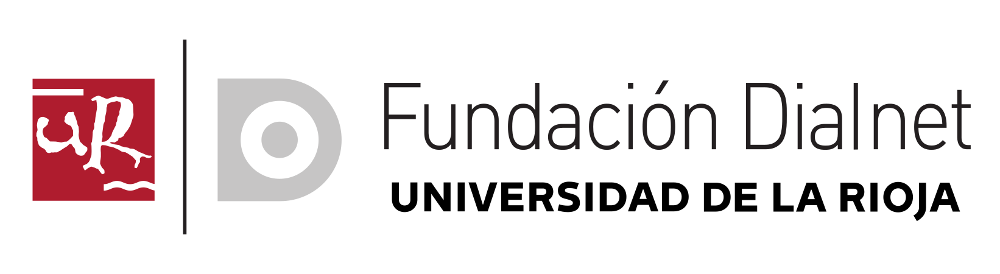
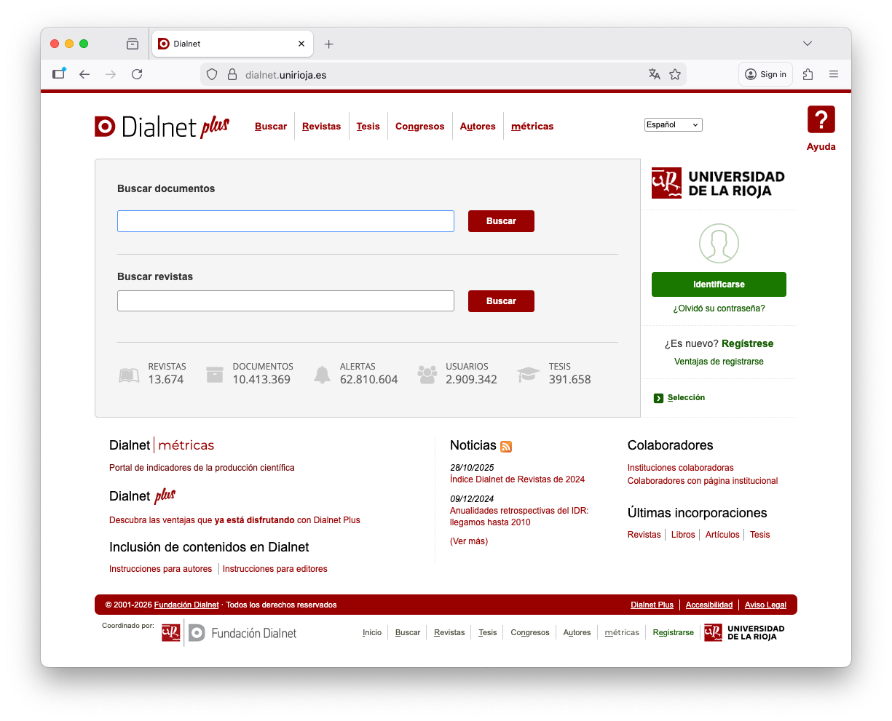
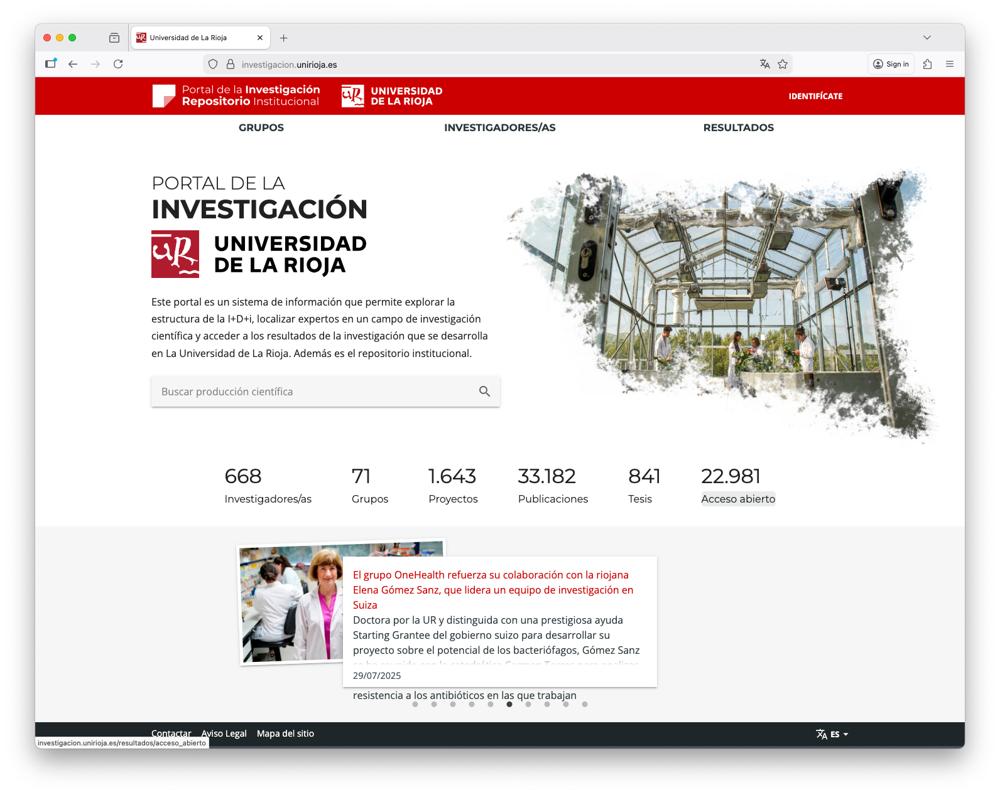
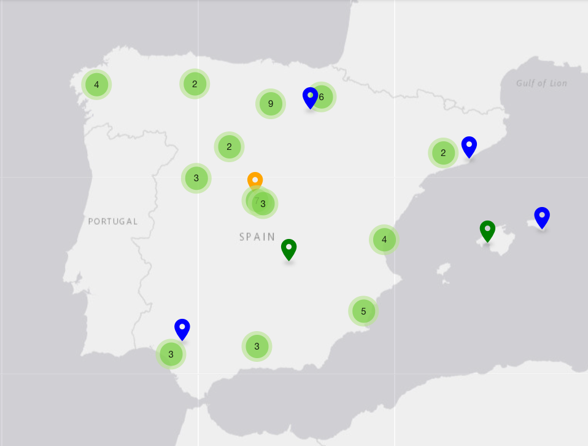
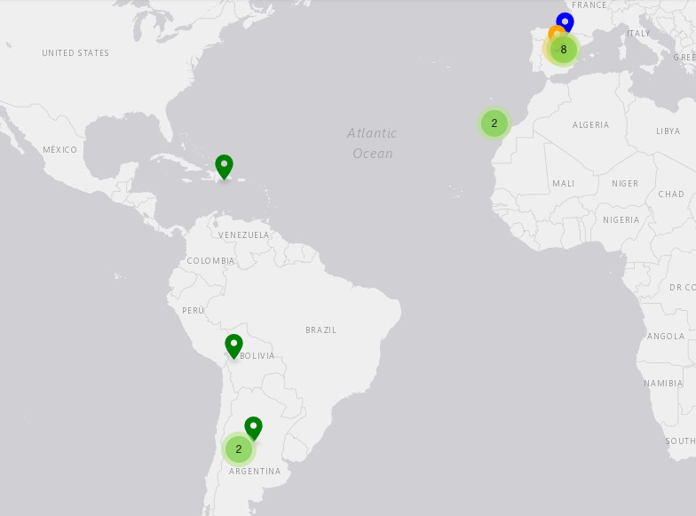
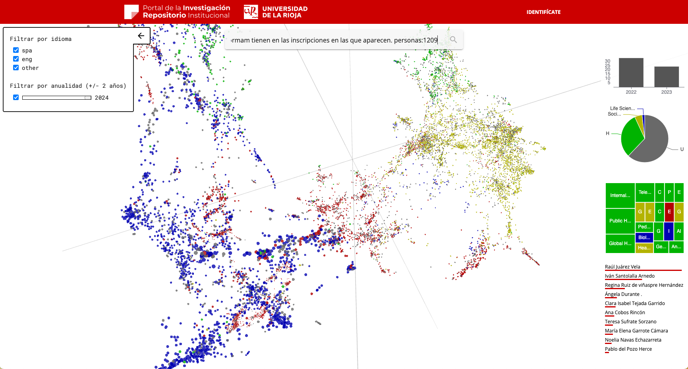

<!-- .slide: class="portada" -->

# Los servicios basados en datos y la construcción de ecosistemas científicos

Dialnet · Dialnet CRIS

<small>**Eduardo Bergasa Balda** · Fundación Dialnet ·</small>

<small>Instituto Cervantes · Madrid · 3 de marzo de 2026 · CLARIAH-ES</small>

---

<!-- .slide: style="font-size: 0.72em" -->

## Estructura de la presentación

- Dialnet y Dialnet CRIS.
- La recogida y agregación del dato
	- Las fuentes de los datos y los mecanismos de entrada y agregación
  - La importancia de construir un buen dataset
- Servicios basados en datos
	- Servicios para investigadores, descargas, control de su producción, 
	- Servicios para la organización, evaluación del desempeño
- Enriquecimiento y uso de la IA.
  - Clasificación automática
  - Caracterización semántica de los registros
  - Construcción de herramientas innovadoras. 
  - Mapeo de la producción institucional

---

<!-- .slide: class="separador" -->

## 01 · Dialnet y Dialnet CRIS

Infraestructura de información científica al servicio de la comunidad

---

## Dialnet vs Dialnet CRIS

  

    
    
Dialnet

  

  

    
    
Dialnet CRIS

  

---

<!-- .slide: style="font-size: 0.8em" -->

## Dialnet CRIS

*Current Research Information System*

- Sistema de información sobre la investigación de instituciones afiliadas
- Integra datos de **investigadores, grupos, proyectos y producción científica**
- Conecta Dialnet con los sistemas institucionales (Sistemas locales, ORCID, DOI…)
- Base para servicios de valor añadido y análisis bibliométrico

→ El proveedor de servicios de información científica

---

## Dialnet CRIS en España

  

    
  

  

    <!-- 67 instalaciones -->
    

      
67

      
instalaciones

    

    <!-- 56 universidades -->
    

      
56

      
universidades

    

    <!-- Donut 60% públicas -->
    

      <svg width="140" height="140" viewBox="0 0 100 100" style="display:block; margin:0 auto">
        <circle cx="50" cy="50" r="38" fill="none" stroke="#e0e0e0" stroke-width="10"/>
        <circle cx="50" cy="50" r="38" fill="none" stroke="#16a085" stroke-width="10"
                stroke-dasharray="143.26 238.76"
                stroke-dashoffset="59.69"
                stroke-linecap="round"
                transform="rotate(-90 50 50)"/>
        <text x="50" y="46" text-anchor="middle" font-size="18" font-weight="800" fill="#1a4d8f">60%</text>
        <text x="50" y="60" text-anchor="middle" font-size="7" fill="#555">públicas</text>
      </svg>
      
universidades públicas

    

  

Note:

- 67 instalaciones de Dialnet CRIS

- 56 universidades

- 29 universidades públicas 60%

---

## Dialnet CRIS en el mundo

  

    
  

  

    <!-- 67 instalaciones -->
    

      
67

      
instalaciones

    

    <!-- 56 universidades -->
    

      
56

      
universidades

    

    <!-- Donut 60% públicas -->
    

      <svg width="140" height="140" viewBox="0 0 100 100" style="display:block; margin:0 auto">
        <circle cx="50" cy="50" r="38" fill="none" stroke="#e0e0e0" stroke-width="10"/>
        <circle cx="50" cy="50" r="38" fill="none" stroke="#16a085" stroke-width="10"
                stroke-dasharray="143.26 238.76"
                stroke-dashoffset="59.69"
                stroke-linecap="round"
                transform="rotate(-90 50 50)"/>
        <text x="50" y="46" text-anchor="middle" font-size="18" font-weight="800" fill="#1a4d8f">60%</text>
        <text x="50" y="60" text-anchor="middle" font-size="7" fill="#555">públicas</text>
      </svg>
      
universidades públicas

    

  

---

<!-- .slide: class="separador" -->

## 02 · El dato como materia prima

De la descripción documental a los servicios sobre datos

---

## ¿Qué datos tenemos?

- **Bibliográficos:** metadatos ricos, normalizados, con PIDs
- **Estructuras de investigación:** personas, grupos, institutos
- **Financiación:** proyectos, subvenciones, contratos
- **Bibliométricos:** citas, indicadores, diversas fuentes
- **De uso:** estadísticas de acceso, descargas, citas, tendencias

*La calidad y riqueza del dato determina la calidad del servicio*

---

## La construcción del dataset

- **Fuentes:** , metadatos ricos, normalizados, con PIDs
- Uso de PIDs
- Deduplicació y desambiguación
- **Curación del dato:**
- Técnicas de IA como NER, clasificación automática ...
- **Reto:** mantener el dato actualizado

---

<!-- .slide: class="separador" -->

## 03 · Servicios basados en datos

¿Qué construimos sobre esa infraestructura?

---

## Servicios basados en datos

<ul>
  <li class="fragment"><strong>Perfiles de investigador</strong> — visibilidad e identidad, control de la produccióon</li>
  <li class="fragment"><strong>Análisis bibliométrico</strong> — indicadores para la evaluación, informes bibliométricos, convocatorias</li>
  <li class="fragment"><strong>Mapas de conocimiento</strong> — redes de colaboración</li>
  <li class="fragment"><strong>Informes institucionales</strong> — producción científica, desempeño institucional</li>
  <li class="fragment"><strong>Evaluación del rendimiento</strong> — novedades personalizadas</li>
  <li class="fragment"><strong>Integración con repositorios</strong> — OA, texto completo</li>
  <li class="fragment"><strong>Interoperabilidad</strong> — OAI-PMH, Mecanismos de integración con los sistemas institucionales</li>
</ul>

---

## Dashboard institucional

<video controls style="width:100%; max-height:560px">
  <source src="pciencia-documentos-insights.mp4" type="video/mp4">
</video>

---

## Mapa multidimensional de conocimiento

---

<!-- .slide: class="separador" -->

## 06 · Conclusiones

Lo que nos llevamos de aquí

---

## Conclusiones

<ul>
  <li class="fragment">Los <strong>datos de calidad</strong> son la base de cualquier servicio de valor</li>
  <li class="fragment">Dialnet CRIS convierte metadatos en <strong>infraestructura de ecosistema</strong></li>
  <li class="fragment">La apertura no es un fin, sino una <strong>estrategia de crecimiento colaborativo</strong></li>
  <li class="fragment">Las bibliotecas son agentes clave en la <strong>construcción de ciencia abierta</strong></li>
  <li class="fragment">La interoperabilidad es condición sine qua non para el <strong>ecosistema científico</strong></li>
</ul>

---

## Gracias

<small>Eduardo Bergasa Balda · Instituto Cervantes · Madrid · 3 de marzo de 2026</small>

