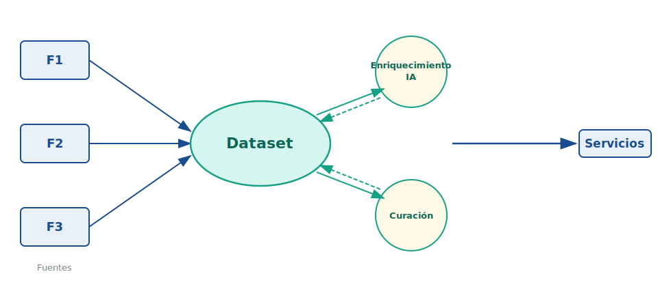

<!-- .slide: class="portada" -->

# Los servicios basados en datos y la construcción de ecosistemas científicos

Dialnet · Dialnet CRIS

<small>**Eduardo Bergasa Balda** · Fundación Dialnet ·</small>

<small>Instituto Cervantes · Madrid · 3 de marzo de 2026 · CLARIAH-ES</small>

Note:

Buenos días, como ven por el título de la presentación hoy vamos a hablar de los servicios basados en datos que ofrece la Fundación Dialnet a través de su infraestrctura de información científica, Dialnet y Dialnet CRIS y como la comunidad científica puede beneficiarse de ellos.

---

<!-- .slide: style="font-size: 0.72em" data-visibility="hidden" -->

## Estructura de la presentación

- Dialnet y Dialnet CRIS.
- La recogida y agregación del dato
	- Las fuentes de los datos y los mecanismos de entrada y agregación
  - La importancia de construir un buen dataset
- Servicios basados en datos
	- Servicios para investigadores, descargas, control de su producción, 
	- Servicios para la organización, evaluación del desempeño
- Enriquecimiento y uso de la IA.
  - Clasificación automática
  - Caracterización semántica de los registros
  - Construcción de herramientas innovadoras. 
  - Mapeo de la producción institucional

---

<!-- .slide: class="separador" -->

## 01 · Dialnet y Dialnet CRIS

Infraestructura de información científica al servicio de la comunidad

---

## Dialnet vs Dialnet CRIS

  

    
    
Dialnet

  

  

    
    
Dialnet CRIS

  

Note: 

Se que muchos de vosotros conocéis bien lo que hace la Fundación Dialnet, pero para aquellos que no venís del ámbito universitario quiero hacer esta pequeña introducción.

Fundación Dialnet dispone de dos grandes servicios:
- Dialnet: La conocidísima gran base de datos de revistas, tesis, libros qye es referente en la comunidad hispanohablante, con más de 10 millones de registros bibliográficos.

- Dialnet CRIS: Que para algunos no será tan conocido, y que es la plataforma de gestión de la información científica insittucional. Que FD ofrece a universidades y otras organizaciones de investigación.

---

<!-- .slide: style="font-size: 0.82em" -->

## Dialnet CRIS

*Current Research Information System*

- Sistema de información de la actividad científica institucional
- Integra datos de **investigadores, grupos, proyectos, financiación y producción científica**

- Base para servicios de valor añadido y análisis bibliométrico

*→ El proveedor de servicios de información científica*

---

## Dialnet CRIS en España

  

    
  

  

    <!-- 67 instalaciones -->
    

      
67

      
instalaciones

    

    <!-- 56 universidades -->
    

      
56

      
universidades

    

    <!-- Donut 60% públicas -->
    

      <svg width="140" height="140" viewBox="0 0 100 100" style="display:block; margin:0 auto">
        <circle cx="50" cy="50" r="38" fill="none" stroke="#e0e0e0" stroke-width="10"/>
        <circle cx="50" cy="50" r="38" fill="none" stroke="#16a085" stroke-width="10"
                stroke-dasharray="143.26 238.76"
                stroke-dashoffset="59.69"
                stroke-linecap="round"
                transform="rotate(-90 50 50)"/>
        <text x="50" y="46" text-anchor="middle" font-size="18" font-weight="800" fill="#1a4d8f">60%</text>
        <text x="50" y="60" text-anchor="middle" font-size="7" fill="#555">públicas</text>
      </svg>
      
universidades públicas

    

  

Note:

- 67 instalaciones de Dialnet CRIS

- 56 universidades

- 29 universidades públicas 60%

---

## Dialnet CRIS en el mundo

  

    
  

  

    <!-- 67 instalaciones -->
    

      
67

      
instalaciones

    

    <!-- 56 universidades -->
    

      
56

      
universidades

    

    <!-- Donut 60% públicas -->
    

      <svg width="140" height="140" viewBox="0 0 100 100" style="display:block; margin:0 auto">
        <circle cx="50" cy="50" r="38" fill="none" stroke="#e0e0e0" stroke-width="10"/>
        <circle cx="50" cy="50" r="38" fill="none" stroke="#16a085" stroke-width="10"
                stroke-dasharray="143.26 238.76"
                stroke-dashoffset="59.69"
                stroke-linecap="round"
                transform="rotate(-90 50 50)"/>
        <text x="50" y="46" text-anchor="middle" font-size="18" font-weight="800" fill="#1a4d8f">60%</text>
        <text x="50" y="60" text-anchor="middle" font-size="7" fill="#555">públicas</text>
      </svg>
      
universidades públicas

    

  

---

<!-- .slide: class="separador" -->

## 02 · El dato como materia prima

De la descripción documental a los servicios sobre datos

Note:
- Para dar unos buenos servicios basados en datos, lo primero que necesitamos es disponer de un buen dataset. Y para eso es fundamental la calidad del dato, la riqueza de los metadatos, la normalización, el uso de identificadores persistentes, la curación del dato y el mantenimiento de su actualización.

---

## ¿Qué datos tenemos?

- **Bibliográficos:** metadatos ricos, normalizados, con PIDs
- **Estructuras de investigación:** personas, grupos, institutos
- **Financiación:** proyectos, subvenciones, contratos
- **Bibliométricos:** citas, indicadores, diversas fuentes
- **De uso:** estadísticas de acceso, descargas, citas, tendencias

*La calidad y riqueza del dato determina la calidad del servicio*

---
<!-- .slide: style="font-size: 0.78em" -->

## La construcción del dataset

  

- Múltiples y diversas **fuentes**
- Uso de **PIDs**
- Enlazado, deduplicación y desambiguación
- **Curación del dato:** en origen, y posterior. La colaboración es clave.
- Técnicas de **IA**: NER, clasificación automática, extracción de kws, caracterización semántica...

-> **Reto:** mantener el dato actualizado

  

  

    
  

---

<!-- .slide: class="separador" -->

## 03 · Servicios basados en datos

¿Qué construimos sobre esa infraestructura?

Note:
¿Y sobre este dataset qué servicios podemos construir? 

---

<!-- .slide: style="font-size: 0.8em" -->

## Destinatarios de los servicios

- Investigador
- Organización que investiga
- **I**nvestigador **P**rincipal del grupo
- Responsables de la *política científica*
- Entidades convocantes de evaluación: ANECA, CNEAI...
- Entidades **financiadoras** de proyectos de investigación
- Bibliotecas
- Medios de comunicación
- Sociedad en general

---

## Servicios para el investigador

- *Visibilidad* y difusión de la producción científica
- Control de la producción científica
- Interactuar con el sistema, enriqueciendo su perfil y comunicación con la biblioteca
- Gestión curricular, exportación de datos e informes a medida
- Facilita acudir a convocatorias de evaluación.
- Facilita el rendimiento de cuentas y evaluación de proyectos de investigación
- Facilidad para el depósito y cumplimiento de política de acceso abierto

Note:

- Disponer en una página con toda su trayectoria científica: publicaciones, datos de investigación, patentes, proyectos, trabajos académicos, colaboraciones…

- Acceder a un menú personal para añadir información propia: palabras clave, breve CV en distintos idiomas, foto…

- Disponer de un canal de comunicación con la biblioteca para remitir publicaciones que le falten, solicitar el depósito de textos completos junto a sus publicaciones y comunicar errores.

- Descargar en distintos formatos su producción e indicadores.

- Realizar informes a medida para distintas convocatorias o concurso de méritos.
- Reducir la carga administrativa
- Mejorar su posicionamiento científico, mejorando su visibilidad
- Facilidad para depositar en repositorio institucional y cumplimiento de políticas de acceso abierto.
- Gestión centralizada del CV científico

---

## Servicios para la organización que investiga

- Visibilidad y difusión de la actividad investigadora
- Control y trazabilidad de la producción científica
- Herramientas para medir el desempeño y la eficiencia de la investigación. Dashboard
- Evaluación de investigadores y grupos de investigación
- Reintegración de los datos en otros sistemas institucionales

Note:

- Permite recoger en una única plataforma el conjunto de publicaciones, textos completos, trabajos académicos, financiación, patentes, indicadores, colaboraciones…; para analizar los resultados mediante informes a medida.

- Disponer de herramientas para medir la producción, indicadores bibliométricos y de reputación.

- Escaparate para presentar con trasparencia la financiación de estancias, contratos y proyectos entre otros.

- Visión Global y trazabilidad de la actividad investigadora

---

## Para el IP del grupo

- Control de la producción científica del grupo
- Herramientas para medir el desempeño y la eficiencia de la investigación del grupo
- Facilita acudir a convocatorias de proyectos y evaluación

---

## Para responsables de la política científica

- Información para la toma de decisiones. Cuadros de mando.
- Evaluación de investigadores, grupos, departamentos, áreas
- Evaluación de proyectos de investigación
- Evaluación de instituciones de investigación
- Medición del desempeño, eficiencia y retorno de la investigación
- Control del cumplimiento de políticas de acceso abierto 
- Análisis de tendencias y áreas emergentes

---

## Para entidades convocantes de evaluación

- Permite validar la veracidad de la información aportada
- Simplifica la gestión de la información aportada, interoperabilidad con sus sistemas de gestión de evaluación, cvn
- Facilita la evaluación de los investigadores y grupos de investigación

---

## Para entidades financiadoras de proyectos de investigación

- Simplifica la gestión de la información aportada
- Facilita la evaluación de los proyectos de investigación
- Permite medir el impacto de los proyectos de investigación financiados

---

<!-- .slide: style="font-size: 0.7em" -->

## Para las bibliotecas

- Como herramienta para dar mejores *servicios de apoyo* a la investigación
- *Control de la producción* científica
- Ayuda a *cumplir los principios de ciencia abierta*
- Proporciona servicio de *repositorio institucional*, permitiendo almacenar y difundir la producción científica de manera más eficiente y controlada 
- (o bien) Integración con repositorios institucionales, facilitando el depósito de textos completos y el cumplimiento de políticas de acceso abierto.

Posicionar a la biblioteca como agente clave en la construcción de ciencia abierta.

---

## Para la sociedad

- Permite a la sociedad conocer la producción científica de las *organizaciones y del país*
- Facilita la comunicación de la ciencia a la sociedad, al proporcionar información verificada y accesible sobre la producción científica y contribuyendo a la educación y al desarrollo de la sociedad
- Transparencia en la investigación, lo que puede contribuir a una mayor confianza en la ciencia y en los investigadores

---

## Para el tejido empresarial

- Facilita la identificación de **expertos y grupos** de investigación para colaboración público-privada y **transferencia** de conocimiento
- Permite **conocer la producción** científica de las organizaciones y del país, lo que puede contribuir a la innovación y al desarrollo económico
- Facilita el acceso a las **infraestructuras** de investigación

---

<!-- .slide: style="font-size: 0.85em" -->

## Para los medios de comunicación

- Permite a los medios de comunicación **conocer la producción** científica de las organizaciones y del país
- Acceso a **trayectorias** científicas verificadas
- Información que **respalda la veracidad** de las noticias científicas, lo que puede contribuir a una mejor comunicación de la ciencia a la sociedad
- Facilita la localización de **expertos** disponibles para entrevistas o para proporcionar información sobre sus investigaciones, lo que puede contribuir a una mejor comunicación de la ciencia a la sociedad

---

## Dashboard institucional

<video controls style="width:100%; max-height:560px">
  <source src="pciencia-documentos-insights.mp4" type="video/mp4">
</video>

---

## Mapa multidimensional de conocimiento

---

<!-- .slide: class="separador" -->

## 06 · Conclusiones

Lo que nos llevamos de aquí

---

## Conclusiones

<ul>
  <li class="fragment">Los <strong>datos de calidad</strong> son la base de cualquier servicio de valor</li>
  <li class="fragment">Dialnet CRIS convierte metadatos en <strong>infraestructura de ecosistema</strong></li>
  <li class="fragment">La apertura no es un fin, sino una <strong>estrategia de crecimiento colaborativo</strong></li>
  <li class="fragment">Las bibliotecas son agentes clave en la <strong>construcción de ciencia abierta</strong></li>
  <li class="fragment">La interoperabilidad es condición sine qua non para el <strong>ecosistema científico</strong></li>
</ul>

---

## Gracias

<small>Eduardo Bergasa Balda · Instituto Cervantes · Madrid · 3 de marzo de 2026</small>

